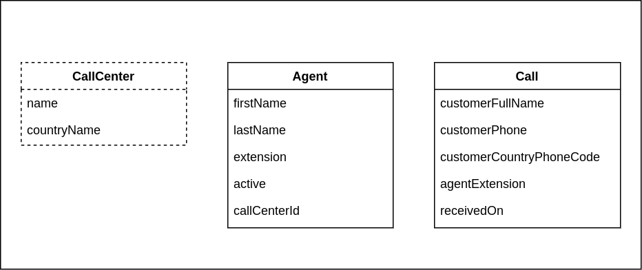

# Livevox Java Coding Challenge 2022

Thank you for taking our coding challenge, the following is an overview of the domain where you are going to show off by implementing your skills to fulfill the requirements.

## Agent Management App (AMA)
### Overview

AMA has the following functionalities:

- Admin Dashboard
- Agent creation / modification / listing
- Call center creation / modification / listing
- Received calls report

Our software is intended to provide a solution to call centers and its agents, to receive calls continuously and connect customers in an effective way.
Unfortunately, it is far from complete and only a couple of APIs and UI page/elements have been implemented. 



Currently, we have created `Agent` and `Call` classes, and some APIs to list calls, create, retrieve and list agents. 
An in-memory database (H2), along with test data is being loaded right now when the application runs to demo some of these functionalities.

## How to run it

Backend and frontend applications will be deployed on different servers, so you need to start them separately:    

To start the spring-boot backend you can execute:

```shell
./run_backend.sh
```

Once backend is running, you can access the H2 console in:

  - http://localhost:8050/app/h2
  - **Driver Class:** `org.h2.Driver`
  - **JDBC URL:** `jdbc:h2:mem:app_db`
  - **user:** `sa`
  - **password:** `password`

Frontend application is under `/webapp`. In order to install dependencies and start it, you can execute:

```shell
./run_frontend.sh
```

### Tech Stack

- Java 11
    - https://www.oracle.com/java/technologies/javase-jdk11-downloads.html
- Spring-boot 2.5.x
    - https://spring.io/projects/spring-boot
- NodeJs 14+
    - https://nodejs.org/en/
- Create React App 4.0.x
    - https://create-react-app.dev/
- React 17.0.x
    - https://reactjs.org/
- AntDesign 4.16.x
    - https://ant.design/
- AntDesign Charts 1.2.x
    - https://charts.ant.design/
- React Router 5.2.x
    - https://reactrouter.com/

## Requirements

## Base Requirements

1. **Agents**
  - a. An agent can be assigned/unassigned to/from a call center. For this please check [Agent API Contracts](APIS_AGENT.md)
  - b. An agent can be `active` only if it is assigned to a call center; when unassigned then it becomes `inactive` automatically
  - c. An agent's `extension` must be unique inside a call center
  - d. Agent list must allow pagination

2. **Call centers**
  - a. Call centers can be `created`, `retrieved` and `listed`. For this please check [Call Center API Contracts](APIS_CALL_CENTER.md)
  - b. A call center's `name` must be unique inside a country
  - c. Call center list must allow pagination

3. **Fetch calls provided by third party API** 
  - A third party provides the following APIs hosted on `https://external-api-challenge-2022.herokuapp.com`:
    - a. Create a process that should run every hour to import the data provided by [/api/calls/daily](https://external-api-challenge-2022.herokuapp.com/api/calls/daily) into the `calls` table
    - b. The API provides a list of calls for the `current day` with the following structure:
      ```javascript
      {
        "calls": [
          {
            "id": 567,
            "first_name": "Robin",
            "last_name": "Guillet",
            "phone": "+54-322-956-3878", 
            "agent_extension": "340", 
            "call_date": "2022/03/08", 
            "call_time": "02:18:58"
          },
          ...
        ]
      }
      ```
    - c. The data returned by the API has some characteristics that are important during import process:
      - `id` always present
      - `first_name` always present
      - `last_name` can be null
      - `phone` can be null
      - `agent_extension` can be null
      - `call_date` can be null
      - `call_time` always present

      **IMPORTANT:** 
      - If the `phone` field is not present, the call cannot be imported!  

    - d. A call's phone is composed of a plus sign, followed by country phone code and 10 digits structured like this:
      - `+XXX-###-###-####`
      - `+XXX` country phone code prefixed by a `+`
      - `###-###-#####` phone number, digits separated by hyphen
    - e. You can use `/api/countries/{code}` to get the list of countries that match a country phone code
      - For example [/api/countries/57](https://external-api-challenge-2022.herokuapp.com/api/countries/57) for Colombia
    - f. The third party API is not 100% reliable when you invoke it. If during import process something goes wrong, we are interested in knowing the following information if available:
      - `date` and `time` of the error along with its description
      - `id`, `phone`, `agent_extension`, and `date`, `time` and `full name` of the customer related to the imported call

4. **Dashboard**
   - a. Routed calls
     - Total number of routed calls in the database
     - A call is considered `routed` if:
       - The `customerCountryPhoneCode` of the call belongs to a country that matches at least one call center's `country` `AND`
       - The matched call center has one `active` agent `assigned` who matches the `agentExtension` of the call

   - b. Processed calls
     - Total number of processed calls in the database
     - A call is considered `processed` if:
       - The `customerCountryPhoneCode` of the call belongs to a country that matches at least one call center's `country` `AND`
       - The matched call center has at least one `active` agent `assigned` to it

5. Implement any tests you find useful to validate the functionalities

6. Make any adjustment you need to consume the APIs you have created or modified, from the UI 

## Bonus (optional requirements)

1. Implement Agent `update` functionality `backend / frontend`  
   
2. Implement Call center `update` functionality `backend / frontend`

3. Implement `Routed agents` counter in `Dashboard` UI
    - Total number of agents to whom at least one call has been `routed`

4. Implement `Missed calls` counter in `Dashboard` UI
    - Total number of missed calls in the database
    - A call is considered `missed` if it is neither `processed` or `routed`

5. Implement `Calls per country` chart in `Dashboard` UI

## Notes

- An in-memory database is already configured, and it is good enough for our purposes unless you want to scale it up
- It's your time to show your skills off, you are free to expand on any of the requirements  

## Who do I talk to?
### Contact

Once you finish the challenge or if you have any questions, please let us know and reach out to abossi@livevox.com

